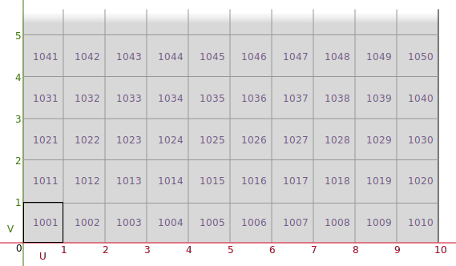

# UV

| Seams 경계선 |     |
| ------------ | --- |
| UV Autoseam  |     |
| Group        |     |

| UV Create               |                                                          |
| ----------------------- | -------------------------------------------------------- |
| UV Project              | 프로젝션 기법을 이용하여 UV 전개                         |
| UV Flatten              | flattening constraints// Seam(이음매), Rectify(바로잡다) |
| AutoUV                  | SideFXLab 에 통합됨                                      |
| UV Unwrap               | 자동 uv 평탄화 및 구릅핑                                 |
| UV Texture              | 평면은 물론, 구형이나 원통형을 UV 전개                   |
| Sweep                   |                                                          |
| UV Pelt                 |                                                          |
| Labs UV Unwrap Cylinder |                                                          |

| UV Editing      |              |
| --------------- | ------------ |
| UV Edit         |              |
| UV Transform    |              |
| UV Fuse         |              |
| UV Layout       | uv 그룹 배치 |
| UV Smooth       |              |
| UV Brush        |              |
| Labs UV Unitize |              |

| Validation                   |     |
| ---------------------------- | --- |
| Labs UV Distortion           |     |
| Labs Calculate UV Distortion |     |
| Labs UV Remove Overlap       |     |
| Labs Texel Density           |     |

| Preview                  |                                                              |
| ------------------------ | ------------------------------------------------------------ |
| UV QuickShade            | 평면 // grid 한장                                            |
| Labs UV Visualize        | UV 시각화   // Visualize UV Islands / Visualize Seams도 있다 |
| Labs Export UV Wireframe |                                                              |

sphere - uvproject (polar)

- UV Layout
  - Connectivity
    - Seperate Edges - 액자같은거 Group으로 edge잘라서
    - Island Attribute - Copy같이 여러개 만들었을때 attribute 만들고 unpack (transfer attribute)하고

udim
https://www.sidefx.com/docs/houdini/solaris/udim.html
UDIM is a system for dividing texture space into multiple “tiles” in UV space, with each tile represented by a separate texture file on disk.

- 1001 기준
  - 1만큼 옆으로(U)
  - 10만큼 위로(V)

---

Labs Automatic Trim Texture
Labs Trim Texture

### UV 펴기

#### Tube

- UV Project
  - Projection: Cylindrical
  - Translate: centroid(opinputpath(".", 0), D_X) | centroid(opinputpath(".", 0), D_Y) | centroid(opinputpath(".", 0), D_Z)
  - Scale: ch("../main_shape/radscale") * 2 | ch("../main_shape/height") * 2 | ch("../main_shape/radscale") * 2

## ref

- [Directed Procedural Workflows with Houdini and Unity](https://youtu.be/Up97rAuXBwU?t=1306)

- [Introduction to Houdini 16: Simple Procedural UVs](https://www.youtube.com/watch?v=YFXdTfdrT4Y)
- [Houdini Tutorial - Under 10 Minutes - How to UV Map complex geometry](https://www.youtube.com/watch?v=T80MY8Qaxp0)
- [Tools in Houdini for normal baking tutorial. Part 1](https://www.youtube.com/watch?v=DN95J9ORp90)
- [Transfer texture maps to new UV coordinates in Houdini](https://www.youtube.com/watch?v=xMwuKEenr4M)
- [Procedural UVs - UV Layout Node in Depth](https://www.youtube.com/watch?v=7kUDLsNn0iA)
- [Houdini Unwrapping Techniques: The Basics](https://www.youtube.com/watch?v=VNX9Qf6a5hs)
- <https://qiita.com/jyouryuusui/items/e15d53e88e9cc018d18f>
- <https://www.technical-artist.net/?p=111>

