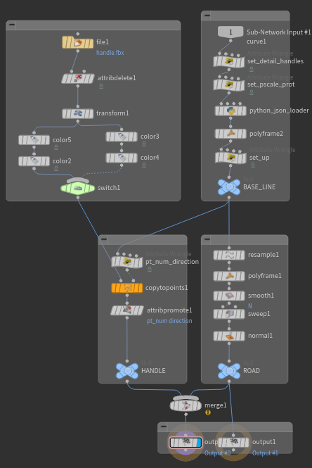

# Python

- [HOM - Houdini Object Model](https://www.sidefx.com/docs/houdini/hom/intro.html)

- <https://jtomori.github.io/2022/2022-07-07.html>
- <https://www.sidefx.com/docs/houdini/hom/commandline.html#hython>

- 환경변수 확인
  - Help > About Houdini > Show Details

- vscode
  - Edit > Preferences > Set External Text Editor
  - https://pakreht.com/houdini/configure-vscode-for-python/
  - https://code.visualstudio.com/docs/python/settings-reference
    - python.pythonPath - 하지만 지금은 Deprecated(더 이상 추천되지 않음) 상태입니다.
    - python.defaultInterpreterPath **최근(2021년 이후)**에 도입된 설정입니다.
    - "python.analysis.extraPaths" 비표준 위치에 설치된 패키지에 대해 IntelliSense를 활성화하려면 해당 위치를 파일 python.analysis.extraPaths의 컬렉션 에 추가하세요
    - python.analysis.stubPath
  - pylance
    - https://marketplace.visualstudio.com/items?itemName=ms-python.vscode-pylance
      - python.analysis.typeCheckingMode
        - off: No type checking analysis is conducted; unresolved imports/variables diagnostics are produced.
        - basic: All rules from off + basic type checking rules.
        - standard: All rules from basic + standard type checking rules.
        - strict: All rules from standard + strict type checking rules.


``` python
# New Pane Tab Type > Python Shell
# ref: https://pakreht.com/houdini/configure-vscode-for-python/
# .vscode/setting.json

import sys
import pathlib
import json

pythonexe_path = pathlib.Path(sys.prefix).resolve().joinpath('python.exe')
sys_paths = [pathlib.Path(p).resolve() for p in sys.path]

vscode_settings = {}
vscode_settings["python.defaultInterpreterPath"] = pythonexe_path.as_posix()
vscode_settings["python.analysis.extraPaths"] = [p.as_posix() for p in sys_paths]
vscode_settings["python.analysis.stubPath"] = 'D:/REPLACE/WITH/YOUR/STUB/PATH'

print(json.dumps(vscode_settings, indent=4))
```

``` txt

Windows > Hscript Textport(Alt + Shift + T)

/ -> help otedit
otedit

    REPLACED BY
      - hou.ui.openTypePropertiesDialog()
```

``` txt
## hython path

Linux: /opt/hfs19.0.657/bin/hython
Windows: C:\Program Files\Side Effects Software\Houdini 19.0.657\bin\hython3.7.exe
```

``` json
// setting.json
"python.autoComplete.extraPaths" : [
  "C:/Program Files/Side Effects Software/Houdini 19.0.531/houdini/python3.7libs"
],

"python.autoComplete.preloadModules" : [
  "hou"
],

"python. analysis.extraPaths" : [
  "C:/Program Files/Side Effects Software/Houdini 19.0.531/houdini/python3.7libs"
]
```

- New Shelf...
  - New Tool...
    - Script

```python

import hou

obj = hou.node('/obj')
myGeo = obj.createNode('geo', 'myGeo')
box = myGeo.createNode('box', 'myBox')

# print(box.ascode())
 
box.parm('sizex').set(10)

selected = hou.selectedNodes() # tuple
selected[0].setInput(0, selected[1], 0)
```

``` python

import Pyside2 as ps

```


hou.playbar.play()
hou.playbar.stop()

hou.ui.displayMessage("HelloWorld")
hou.ui.displayMessage("HelloWorld", buttons=("OK", "NO"))
hou.ui.readInput("Read Input")

hou.frame()
hou.fps()

hou.selectedNodes()

hou.putenv("ENV_A", "VALUE_A")
hou.unsetenv('A')
hou.getenv("HIP")
hou.hda.reloadAllFiles()


hou.hscript("opparm /obj/geo1 scale 10")

n = hou.node("/obj/geo1")
sphere = n.node("sphere1")


node.parent()
node.children()
node.outputs()
node.inputs()
node.setInput(2, otherNode)
node.setInput(2, None)
node.color()
node.setColor(hou.Color(1, 0, 0))
node.setDisplayFlag(False)
node.isGenericFlagSet(hou.nodeFlag.Display)
node.setGenericFlagSet(hou.nodeFlag.Display, True)
// https://www.sidefx.com/docs/houdini/hom/hou/nodeFlag.html

node.type()
node.createNode('attribwrangle')

node.userDataDict()
node.clearUserDataDict()
node.setUserData('keyString', 'valueString')
node.userData('keyString')
node.destroyUserData('keyString')

https://www.sidefx.com/docs/houdini/hom/hou/OpNode.html#user-data
node.cachedUserDataDict()
node.setCachedUserData('keyString', 'valueString')
node.cachedUserData('keyString')
node.destroyCachedUserData('keyString')

node.asCode()

node.name()
node.setName('test')
node.commnet()
node.setComment('comment')
node.appendComment('append comment')
node.path()
node.position()
node.setPosition((0, 0)) // input : vector
node.move((-1, -1))
node.destroy()
node.evalParm('proj')


``` txt
// https://www.sidefx.com/docs/houdini/ref/env.html
// https://www.sidefx.com/docs/houdini/hom/locations.html#startup 

HH                    : The path to Houdini supporting scripts and files inside $HFS. Usually $HFS/houdini
HOUDINI_PATH          : The path of directories where Houdini looks for configuration files.
HOUDINI_USER_PREF_DIR : The directory to store user preference files. 

```


hou.parm     ("/obj/geo1/tx")
hou.parm     ("/obj/geo1/scale")
hou.parmTuple("/obj/geo1/t")
p = hou.parm     ("/obj/geo1/scale")
p.eval()
p.evalAsString()
p.isTimeDependent()
p.evalAtFrame(10)
p.set(5)
p.name()
p.node()
p.pressButton()
p.keyframes()
p.keyframesAfter(20)
p.deleteAllKeyframes()
p.revertToDefault()
p.expression()
p.expressionLanguage()
p.setExpression('print "Hello"', language=hou.exprLanguage.Python)


node = hou.pwd()
geo = node.geometry()
geo.points()
pt = geo.iterPoints()[0]
pt.prims()
pt.vertices()
geo.attribValue('foo')
geo.setGlobalAttribValue('foo', 5)
pt.attribValue('foo')
pt.setAttribValue('foo', 5)
geo.addAttrib(hou.attribType.Prim, 'myattrib', 0.0, create_local_variable=False)

pts = geo.createPoints([(0, 0, 0)])
geo.deletePoints(pts)

group = geo.findPointGroup('grp1')
group = geo.createPointGroup('grp1')
group.clear()
group.destroy()

p = geo.prim(0)
p.intrinsicValue('typename')


hou.ui.displayMessage("HelloWorld", serverity=hou.serverityType.ImportantMessage, help='help message', detail='detail','title='title')
hou.ui.readMultiInput('wtf', ('1', '2', '3'))
hou.ui.selectFile()
hou.ui.selectFromList(('1', '2', '3'))
hou.ui.selectFromTree(('a/1', 'a/2', '3'))
hou.ui.selectNode()
hou.ui.selectParm()
hou.ui.selectParmTuple()
hou.ui.selectAttrib()
hou.ui.selectColor()
hou.ui.setStatusMessage('hello world')


import hou
n = hou.node('/obj/hello')
t = n.type()
d = t.definition()
group = d.parmTemplateGroup()
group = hou.ParmTemplateGroup()
n.setParmTemplateGroup()
d.setParmTemplateGroup()


``` python
import hou
n = hou.node('/obj/geo1/transform1')

new_n = n.parent().createNode(n.type().name(), f"{n.name()}_refcopy")
new_n.setPosition(n.position())
new_n.move((0.5, -0.5))
new_n.setColor(hou.color((0.1, 0.1, 0.1)))

group = new_n.parmTemplateGroup()
source = hou.StringParmTemplate('ref_source', 'Reference Source', 1, string_type=hou.stringParmType.NodeRefernece, help='help text')
group.insertBefore((0, ), source)
new_n.setParmTemplateGroup(group)
new_n.parm('ref_source').set(n.path())

temp_list = [
  hou.parm('obj/geo1/transform1_refcopy/scale'),
  hou.parm('obj/geo1/transform1_refcopy/group'),
  hou.parm('obj/geo1/transform1_refcopy/shear')
]
for p in temp_list:
    if p.name() == 'ref_source':
        continue
    if p.parmTemplate().type() == hou.parmTemplateType.Folder:
        continue
    if p.parmTemplate().type() == hou.parmTemplateType.FolderSet:
        continue

    mode = kwargs['ctrlclick']

    if mode:
        expr = 'ch'
        if p.parmTemplate().type() == hou.parmTemplateType.String:
            expr = 'chs'
        p.setExpression(f"{expr}(chs('ref_resource') + '/{p.name()}')")
    else:
        p.setExpression(f"hou.node(hou.pwd().evalParm('ref_source')).evalParm('{p.name()}')", language=exprLangauge.Python)
```


PythonModule
  def onInputChanged
OnInputChanged
  kwargs['node'].hm().onInputChanged(kwargs) # hm - a shortcut for self.hdaModule().
  - <https://www.sidefx.com/docs/houdini/hom/hou/OpNode.html#hm>


hou.phm().SomeFunction()                     # hou.phm() == hou.pwd().hdaModule()
https://www.sidefx.com/docs/houdini/hom/hou/phm.html
https://www.sidefx.com/docs/houdini/hom/hou/HDAModule.html


---


Tool scripts
https://www.sidefx.com/docs/houdini/hom/tool_script.html

## State

- <https://www.sidefx.com/tutorials/houdini-cable-tool-with-python-viewer-states/>
- [Writing custom viewer states in Python](https://www.sidefx.com/docs/houdini/hom/python_states.html)
- 상태등록
  - Houdini는 시작 시 createViewerStateTemplate상태 템플릿에 접근하여 등록을 수행합니다.
  - viewerstate.utilsHoudini는 뷰어 상태 설치를 지원하고 사용자가 직접 상태를 구현할 수 있도록 다양한 문서화된 유틸리티 함수와 클래스를 포함하는 Python 모듈을 제공합니다.
  - 이 모듈은 $HHP/viewerstate폴더 아래에 있습니다.

``` python
class MyState(object):
  # 생성자는 필수
  def __init__(self, state_name, scene_viewer):
        self.state_name = state_name
        self.scene_viewer = scene_viewer

# Event Handler
#
## Life Cycle
#
# onEnter
# onInterrupt
# onExit
# onResume
# onGenerate
# 
## UI
#
# onMouseEvent
# onMouseDoubleClickEvent
# onMouseWheelEvent
# 
# onKeyEvent
# onKeyTransitEvent
# 
# onMenuAction
# onMenuPreOpen
# 
# onParmChangeEvent
# onPlaybackChangeEvent
# onCommand
# 
## Handle
#
# onHandleToState
# onStateToHandle
# onBeginHandleToState
# onEndHandleToState
# 
## Selection
#
# onStartSelection
# onSelection
# onStopSelection
# onLocateSelection
#
## Drawing
# 
# onDraw
# onDrawInterrupt
#
## Drag & Drop
# 
# onDragTest
# onDropGetOptions
# onDropAccept
#

def createViewerStateTemplate():
    state_typename = kwargs["type"].definition().sections()["DefaultState"].contents() # Edit Operator Type Properties > Node > Default State
    state_label = "Label"
    state_cat = hou.sopNodeTypeCategory()

    template = hou.ViewerStateTemplate(state_typename, state_label, state_cat)
    template.bindFactory(MyState)
    template.bindIcon(kwargs["type"].icon())

    return template

```

## 테스트

- <https://jeroen.denayer.com/>
  - [Houdini: Python Viewer State - Interactive curve point rotation and scaling - Tutorial](https://www.youtube.com/watch?v=2XIIEhgcWMQ)
  - [BUas Procedural Showcase | Aleksandra Radivilovic, Erwin Smeenge, Jens van Kampen, Joshua Rizzo ...](https://www.youtube.com/watch?v=mBdKK_VKDHQ&t=893s)
  - <https://pepri.gumroad.com/l/UHmyL>

- 스크립팅 : Edit Operator Type Properties > Interactive > State Script > New...
- 디버그창 : New Pane Tab Type > Inspectors > Viewer State Browser
- 디버그
  - scene_viewer.setPromptMessage # 말 그대로 씬 뷰어 <https://www.sidefx.com/docs/houdini/hom/hou/SceneViewer.html>
  - self.log # => Viewer State Browser
  - print()  # => 메시지창
  - HUD https://www.sidefx.com/docs/houdini/hom/hud_info.html
    - https://www.sidefx.com/docs/houdini/hom/hou/SceneViewer.html#hudInfo


ui_event = kwargs["ui_event"]
https://www.sidefx.com/docs/houdini/hom/hou/UIEvent.html
    ui_event = kwargs["ui_event"]
    reason = ui_event.reason() # https://www.sidefx.com/docs/houdini/hom/hou/uiEventReason.html
    dev = ui_event.device()    # https://www.sidefx.com/docs/houdini/hom/hou/UIEventDevice.html
    self.log("Mouse:", dev.mouseX(), dev.mouseY(), dev.isLeftButton())


geometry = self._node.geometry(0)
https://www.sidefx.com/docs/houdini/hom/hou/Geometry.html
    intersected = geometry.intersect(origin, direction, position, normal, uvw)

state_parms = kwargs["state_parms"]
바인딩된 파라미터
https://www.sidefx.com/docs/houdini/hom/state_parameters.html#binding-the-parameter


``` txt
Edit Operator Type Properties > Parameters

- p_shift Integer 
- p_json  String
- p_reset Button
```

``` python
# 버튼 > Callback script
# hou.pwd().hm().reset(kwargs)

# Edit Operator Type Properties > Scripts - Event Handler가 Python Module인거 확인
import json

def reset(kwargs):
    node = kwargs["node"]

    npoints = 0
    geo = node.geometry()
    if geo:
        npoints = geo.attribValue("handles")
    
    json_list = [{"banking": 0, "scale": 0} for _ in range(npoints)]
    json_parm = node.parm("p_json")
    json_parm.set(json.dumps(json_list))
```

``` python
# Edit Operator Type Properties > Interactive > State Script > New...
import hou
import json
from typing import TypedDict

class Item(TypedDict):
    scale: float
    banking: float

class Util:
    @staticmethod
    def clamp(x: int, min_val: int, max_val: int) -> int:
        return max(min_val, min(x, max_val))

class State(object):
    
    MSG = "Click and drag to rotate, hold shift to scale"

    def __init__(self, state_name, scene_viewer):
        self._state_name = state_name
        self._scene_viewer = scene_viewer

        self._node = None
        self._p_shift: int = 0
        self._p_json: str = ''

        self._json_list: list[Item] = [] # [{"banking": 0, "scale": 0}, ...]
        self._selected_pt_num: int = -1
        self._mouse_x_start: int = 0
        self._offset_sign: int = 1

    def onEnter(self, kwargs):
        self._node = kwargs["node"]
        self._p_shift = self._node.parm("p_shift") # hda 파라미터 이름
        self._p_json = self._node.parm("p_json")   # hda 파라미터 이름
        
        self._scene_viewer.setPromptMessage(State.MSG)
 
        geo = self._node.geometry(0)
        npoints = 0
        if geo:
            npoints = geo.attribValue("handles")
            
        json_str = self._p_json.eval()
        if not json_str:
            self._json_list = self._resize([], npoints)
            return
        
        loaded = json.loads(json_str)
        self._json_list = self._resize(loaded, npoints)

    def _resize(self, lst: list, cnt: int) -> list:
        diff: int = len(lst) - cnt
        if diff < 0:
            return lst + [Item(scale= 1, banking= 0) for _ in range(abs(diff))]
        elif diff > 0:
            return lst[:cnt]
        else:
            return lst

    def onMouseEvent(self, kwargs):
        ui_event = kwargs["ui_event"]

        reason = ui_event.reason()
        dev = ui_event.device()
        # self.log("Mouse:", dev.mouseX(), dev.mouseY(), dev.isLeftButton())
        
        if reason == hou.uiEventReason.Start:
            self._mouse_x_start = dev.mouseX()
        
            geo = self._node.geometry(0)
            origin, direction = ui_event.ray()
            position = hou.Vector3()
            normal = hou.Vector3()
            uvw = hou.Vector3()
            intersected = geo.intersect(origin, direction, position, normal, uvw)
            
            if intersected == -1:
                self._selected_pt_num = -1
                return False
            
            prim = geo.prim(intersected)
            self._selected_pt_num = prim.attribValue("pt_num")
            normal = prim.floatListAttribValue("direction")
            normal = hou.Vector3(normal)
            angle = direction.angleTo(normal)
            if angle < 90:
                self._offset_sign = 1
            else:
                self._offset_sign = -1
            return False

        if reason == hou.uiEventReason.Active:
            if self._selected_pt_num == -1:
                return False
            
            x_offset = dev.mouseX() - self._mouse_x_start
            self._mouse_x_start = dev.mouseX()
            pt_dict: Item = self._json_list[self._selected_pt_num]
                
            if self._is_shift():
                next_scale = pt_dict["scale"] + x_offset
                pt_dict["scale"] = Util.clamp(next_scale, -800, 5000)
            else:
                next_banking = pt_dict["banking"] + (self._offset_sign * x_offset)
                pt_dict["banking"] = next_banking
            # self._json_list[self._selected_pt_num] = pt_dict
            json_str = json.dumps(self._json_list)
            self._p_json.set(json_str)

        # Must return True to consume the event
        return False

    def onKeyTransitEvent(self, kwargs):
        ui_event = kwargs["ui_event"]

        if ui_event.device().isShiftKey():
            self._p_shift.set(1)
        else:
            self._p_shift.set(0)
        # Must returns True to consume the event
        return False

    def _is_shift(self) -> bool:
        return self._p_shift.evalAsInt() == 1


def createViewerStateTemplate():
    state_typename = kwargs["type"].definition().sections()["DefaultState"].contents()
    state_label = "P3tpr subnet1"
    state_cat = hou.sopNodeTypeCategory()

    template = hou.ViewerStateTemplate(state_typename, state_label, state_cat)
    template.bindFactory(State)
    template.bindIcon(kwargs["type"].icon())

    return template

## dataclass도 고려해봤지만, 이건 내장 json로더가 손이 간다.
## Interactive쪽에만 코드를 짜면 dataclass를 어찌 집어넣을 수 있겠지만, python노드에서 로더부분을 건드리면 비용이 배가 될것이다.
## import dataclasses
## 
## class JSON(json.JSONEncoder):
##     def default(self, o):
##         if dataclasses.is_dataclass(o):
##             return dataclasses.asdict(o)
##         return super().default(o)
##     
##     @staticmethod
##     def to_str(o: object) -> str:
##         return json.dumps(o, cls=JSON)
## 
## @dataclasses.dataclass
## class Item:
##     scale: float
##     banking: float
## 
## def load_items(json_str: str) -> list[Item]:
##     data = json.loads(json_str)
##     return [Item(**item) for item in data]
```

노드



- detail wrangle
  - i@handles = npoints(0);
- Point Wrangle
  - f@pscale = 1;
  - @prot = 0;
- python
``` python
# 커브 인풋에서 Python 노드 추가
#  - Edit Parameter Interface - json_in String 넣기
# 추가한 json_in텍스트에 `chs("../p_json")` 넣기
#  - 그러면 hou.evalParm("./json_in") 로 불러오기 가능
#  - 아니면 곧 바로 hou.evalParm("../p_json")

import json

node = hou.pwd()
geo = node.geometry()

json_str = hou.evalParm("./json_in")
json_list = []
if json_str:
    json_list = json.loads(json_str)

for point in geo.points():
    pt_num = point.number()
    try:
        pt_dict = json_list[pt_num]
    except:
        break
    
    pscale = pt_dict["scale"]
    pscale = (pscale + 1000) / 1000    
    prot = pt_dict["banking"] / 1000
    
    point.setAttribValue("pscale", float(pscale))
    point.setAttribValue("prot", float(prot))
```
- Poly Frame
  - Tangent : N
- point wrangle
  ``` vex
  vector up = set(0,1,0);
  float angle = f@prot;
  matrix rot = ident();
  vector axis = @N;
  rotate(rot, angle , normalize(axis));
  vector rotateP = up * rot;
  @up = rotateP;
  ```

여기까지가 BASE_LINE

- point Wrangle
  ``` vex
  i@pt_num = @ptnum;
  v@direction = @N;
  ```
- Copy To Point
- Attribute Promote
  - pt_num, direction:point => primitive

--------------------------------------------------------------------------------------------------------------------------------
--------------------------------------------------------------------------------------------------------------------------------
--------------------------------------------------------------------------------------------------------------------------------

Jeroen Denayer는 여기서 한발 더 나갔다

``` txt
- scale
- scale_left
- scale_right
- bank


curve_pos
handle_type
basic__rotation
basic_road_width
basic_road_width_hide
delete__length
rail__length


def getAllHandleTypeParms():
    main_floder = ptg.find("f_activeHandleParms")
    pts = main_floder.parmTemplates()

    parms = []
    for pt in pts:
    if pt.type() != hou.parmTemplateType.Folder:
        parms.append(pt.name())
    else:
        pt_folder = pt
        for pt in pt_folder.parmTemplates():
            if "_hide" not in pt.name():
                parms.append(pt.name())
                
    return parms
    
parms = getAllHandleTypeParms()
node.parm("allHandParms").set(json.dumps(parms))


def updateActiveHandleParm(kwargs, re_draw_ui = False):
    # Update the json when an active handle parameter changes value.

    node, parm_name = kwargs['node'], kwargs['parm_name']
    phm = node.hdaModule()
    jsp, jsl, ahps, ah = phm.getParmsAndValues(node)
    
    value = node.parm(parm_name).eval()
    jsl[ah][name] = value
    jsp.set(json.dumps(jsl))

```

