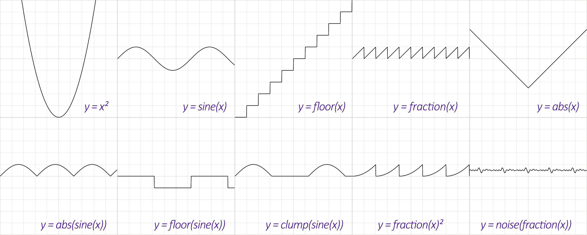

# Joy Of Vex

- <https://www.tokeru.com/cgwiki/JoyOfVex.html>
  - https://github.com/jtomori/vex_tutorial
- [Houdini Hangout - The Joy of VEX](https://www.youtube.com/playlist?list=PLTXmnikJEYnBtSfn4LwKx5vpopwrInp18)
- [TWA 후디니의 정석 - JOY_OF_VEX(한국어.ver)](https://www.youtube.com/playlist?list=PLcg9CGPYCmygYPz1dYyyShhoUYRLz_MIz)
- <https://github.com/kiryha/Houdini/wiki/vex-for-artists>




## List

- [JoyOfVex01](https://www.tokeru.com/cgwiki/JoyOfVex01.html) basic assignment, component assignment, arithmetic manipulation
- [JoyOfVex02](https://www.tokeru.com/cgwiki/JoyOfVex02.html) length and distance functions, animate with @Time
- [JoyOfVex03](https://www.tokeru.com/cgwiki/JoyOfVex03.html) clamp and fit, waves
- [JoyOfVex04](https://www.tokeru.com/cgwiki/JoyOfVex04.html) chramp, using on attrib components, on time, on reranging outputs
- [JoyOfVex05](https://www.tokeru.com/cgwiki/JoyOfVex05.html) modulo, more arithmetic tricks (quantising), but show that often a chramp is easier (eg stepped chramp);
- [JoyOfVex06](https://www.tokeru.com/cgwiki/JoyOfVex06.html) point wrangle vs prim wrangle vs detail wrangle, user defined attributes
- [JoyOfVex07](https://www.tokeru.com/cgwiki/JoyOfVex07.html) using the other inputs on wrangles, do things to geometry based on other geometry
- [JoyOfVex08](https://www.tokeru.com/cgwiki/JoyOfVex08.html) noise, various types, how it can be scaled, vector vs scalar noise, why you might use vops here instead
- [JoyOfVex09](https://www.tokeru.com/cgwiki/JoyOfVex09.html) dot and cross product, fake lighting combing normals to a surface, vector maths primer
- [JoyOfVex10](https://www.tokeru.com/cgwiki/JoyOfVex10.html) relpointbbox
- [JoyOfVex11](https://www.tokeru.com/cgwiki/JoyOfVex11.html) if statements
- [JoyOfVex12](https://www.tokeru.com/cgwiki/JoyOfVex12.html) nearpoints, arrays
- [JoyOfVex13](https://www.tokeru.com/cgwiki/JoyOfVex13.html) for loops (ties nicely into arrays)
- [JoyOfVex14](https://www.tokeru.com/cgwiki/JoyOfVex14.html) creating geometry, deleting geometry, debugging vex
- [JoyOfVex15](https://www.tokeru.com/cgwiki/JoyOfVex15.html) copy sop, simple instance attributes (pscale)
- [JoyOfVex16](https://www.tokeru.com/cgwiki/JoyOfVex16.html) copy sop, midweight instance attributes (scale, N)
- [JoyOfVex17](https://www.tokeru.com/cgwiki/JoyOfVex17.html) copy sop, orient, quaternions
- [JoyOfVex18](https://www.tokeru.com/cgwiki/JoyOfVex18.html) intrinsics
- [JoyOfVex19](https://www.tokeru.com/cgwiki/JoyOfVex19.html) primuv, xyzdist
- [JoyOfVex20](https://www.tokeru.com/cgwiki/JoyOfVex20.html) pointclouds, further learning


### 01

- Attribute Wrangle
  - Runs a VEX snippet to modify attribute values.
  - Wrangle : 다루다


|             |                  |
| ----------- | ---------------- |
| @Cd         | 색상             |
| @N          | 노말             |
| @ptnum      | 해당 포인트 번호 |
| @numpt      | 포인트 총 갯수   |
| ch('scale') | 채널             |
| sin         | 사인             |

``` vex
@Cd = @N;
@Cd = @P;
@Cd = @ptnum/@numpt;
@Cd = float(@ptnum) / ch('scale');
@Cd = sin(@ptnum);
```

<https://www.sidefx.com/docs/houdini/hom/hou/Geometry.html>
<https://www.sidefx.com/docs/houdini/hom/hou/Point.html>
<https://docs.python.org/3.13/library/math.html>
<https://www.sidefx.com/docs/houdini/hom/hou/index.html#parmtemplates_group>


``` python

node = hou.pwd()
geo = node.geometry()

if not geo.findPointAttrib("Cd"):
    geo.addAttrib(hou.attribType.Point, "Cd", (1.0, 1.0, 1.0))

if not geo.findPointAttrib("N"):
    geo.addAttrib(hou.attribType.Point, "N", (0.0, 1.0, 0.0))

points = geo.points()

numpt = len(geo.points())                # @numpt
numpt = geo.intrinsicValue("pointcount") # @numpt

for point in points:
    P     = point.position()       # @P
    ptnum = point.number()         # @ptnum
    N     = point.attribValue("N") # @N

    point.setAttribValue("Cd", P)
```

``` python
import math

radian = 1.0
sin_value = math.sin(radian)
```

``` python
def AddParameters():
    parameters = [
        # hou.FloatParmTemplate(name, label, num_components, ...)
        hou.FloatParmTemplate("scale", "scale", 1, default_value=(1.0,), min=0.0, max=10.0),
    ]

    node = hou.pwd()
    parm_template_group = node.parmTemplateGroup()
    for param in parameters:
        param_name = param.name()
        if not node.parm(param_name):
            parm_template_group.append(param)
    node.setParmTemplateGroup(parm_template_group)
```

### 02

length(@P) == distance(@P, {0, 0, 0})

|     |                                                                                              |
| --- | -------------------------------------------------------------------------------------------- |
| chf | hou.FloatParmTemplate("scale", "scale", 1, default_value=(1.0,         ), min=0.0, max=10.0) |
| chv | hou.FloatParmTemplate("scale", "scale", 3, default_value=(1.0, 1.0, 1.0), min=0.0, max=10.0) |

fit(v, in_min, in_max, out_min, out_max);


@Time : Float time ($T)                                             |


### 03

``` vex
float d = length(@P);
d *= ch('v_scale');
d += @Time;
@P.y = sin(d);
```

clamp(v, min, max);

### 04

chramp

### 05

trunc

### 06

::pass

### 07

https://www.sidefx.com/docs/houdini/vex/functions/minpos.html
minpos VEX function
Given a position in world space, returns the position of the closest point on a given geometry.

https://www.sidefx.com/docs/houdini/vex/functions/nearpoint.html
nearpoint VEX function
Finds the closest point in a geometry.


 @P = point(1, 'P', @ptnum);
 @P = @opinput1_P;


### 08

noise
curlnoise
pnoise

### 09

dot
cross

### 10

normalize
relpointbbox

### 11

if

### 12

|          |           |
| -------- | --------- |
| Ctrl + / | 라인 주석 |

### 13

``` vex
foreach( element; array)
{
    // do things to element
}
```


``` vex
for ( starting value; test; value increment)
{

}
```

### 14

addpoint  // removepoint
addprim   // removeprim
addvertex // removevertex 

### 15

::pass

### 16

::pass

### 17

quaternion

``` vex
float angle = ch('angle');
vector axis = chv('axis');

@orient = quaternion(angle, axis);
```

``` vex
@N = {0,1,0};
float s = sin(@Time);
float c = cos(@Time);
@up = set(s,0,c);

@orient = quaternion(maketransform(@N, @up));
```


``` vex
matrix3 m = ident();
@orient = quaternion(m);


vector rot = radians(chv('euler'));
@orient = eulertoquaternion( rot, 0);


vector4 a = {0,0,0,1};
vector4 b = quaternion({0,1,0}*$PI/2);
@orient = slerp(a, b, ch('blend') );


@orient = qmultiply(@orient, extrarot);
matrix m = qconvert(@orient);
```


radians
qconvert

https://www.sidefx.com/docs/houdini/vex/attribtypeinfo_suite.html
Sets the meaning of an attribute in geometry.
int  setattribtypeinfo(int geohandle, string attribclass, string name, string typeinfo)


### 18

``` vex
matrix3 m = ident();
setprimintrinsic(0, 'transform', 0, m);
```


``` vex
matrix3 m = matrix3( myfancy4x4matrix);
matrix pft = primintrinsic(0,'packedfulltransform',@ptnum);
matrix3 rotandscale = matrix3(pft);
3@b = rotandscale;
```

### 19

``` vex
vector uv = chv('uv');

@P = primuv(1,'P',0,uv);
@N = primuv(1,'N',0,uv);
```


``` vex
i@primid;
v@uv;
@dist;

@dist = xyzdist(1,@P, @primid, @uv);

@P = primuv(1,'P',@primid, @uv);
```

### 20

``` vex
int pts[] = nearpoints(1,@P,ch('d'),25);
int pt;
vector pos;
foreach (pt; pts)
{
  pos = point(1,'P',pt);
  addpoint(0,pos);
}


int pts[] = pcfind(1,'P',@P,ch('d'),25);
int pt;
vector pos;
foreach (pt; pts)
{
  pos = point(1,'P',pt);
  addpoint(0,pos);
}
```

pcopen
pcfilter

``` vex
int pc = pcopen(0,'P',@P, ch('dist'), chi('maxpoints'));
@Cd = pcfilter(pc, 'Cd');
```